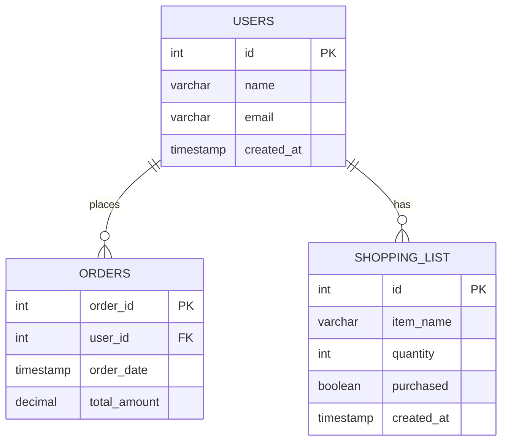

# SQL 教學

## 簡介
本教學將介紹如何使用 pg-sql.com 來建立資料庫、資料表及示範 SQL 語法。

## 建立資料庫
1. 打開 [pg-sql.com](https://pg-sql.com/)
2. 在左側的 SQL 編輯器中輸入以下指令來建立一個新的資料庫：
   ```sql
   CREATE DATABASE my_database;
   ```
3. 點擊 "Run" 按鈕執行指令。

## 建立資料表
1. 選擇剛剛建立的資料庫 `my_database`。
2. 在 SQL 編輯器中輸入以下指令來建立一個新的資料表：
   ```sql
   CREATE TABLE users (
       id SERIAL PRIMARY KEY,
       name VARCHAR(100),
       email VARCHAR(100) UNIQUE,
       created_at TIMESTAMP DEFAULT CURRENT_TIMESTAMP
   );
   ```
3. 點擊 "Run" 按鈕執行指令。

## 示範 SQL 語法

### 插入資料
使用以下指令插入資料到 `users` 資料表：
```sql
INSERT INTO users (name, email) VALUES ('John Doe', 'john.doe@example.com');
```

### 查詢資料
使用以下指令查詢 `users` 資料表中的所有資料：
```sql
SELECT * FROM users;
```

### 更新資料
使用以下指令更新 `users` 資料表中的資料：
```sql
UPDATE users SET name = 'Jane Doe' WHERE email = 'john.doe@example.com';
```

### 刪除資料
使用以下指令刪除 `users` 資料表中的資料：
```sql
DELETE FROM users WHERE email = 'john.doe@example.com';
```

## 以日常生活例子示範 SQL 語法

### 建立資料表：購物清單
1. 在 SQL 編輯器中輸入以下指令來建立一個新的資料表：
   ```sql
   CREATE TABLE shopping_list (
       id SERIAL PRIMARY KEY,
       item_name VARCHAR(100),
       quantity INT,
       purchased BOOLEAN DEFAULT FALSE,
       created_at TIMESTAMP DEFAULT CURRENT_TIMESTAMP
   );
   ```
2. 點擊 "Run" 按鈕執行指令。

### 插入資料：購物清單
使用以下指令插入資料到 `shopping_list` 資料表：
```sql
INSERT INTO shopping_list (item_name, quantity) VALUES ('Milk', 2);
INSERT INTO shopping_list (item_name, quantity) VALUES ('Bread', 1);
INSERT INTO shopping_list (item_name, quantity) VALUES ('Eggs', 12);
```

### 查詢資料：購物清單
使用以下指令查詢 `shopping_list` 資料表中的所有資料：
```sql
SELECT * FROM shopping_list;
```

### 更新資料：購物清單
使用以下指令更新 `shopping_list` 資料表中的資料：
```sql
UPDATE shopping_list SET purchased = TRUE WHERE item_name = 'Milk';
```

### 刪除資料：購物清單
使用以下指令刪除 `shopping_list` 資料表中的資料：
```sql
DELETE FROM shopping_list WHERE item_name = 'Bread';
```

## 外部資料連接範例

### 建立資料表：訂單
1. 在 SQL 編輯器中輸入以下指令來建立一個新的資料表：
   ```sql
   CREATE TABLE orders (
       order_id SERIAL PRIMARY KEY,
       user_id INT,
       order_date TIMESTAMP DEFAULT CURRENT_TIMESTAMP,
       total_amount DECIMAL(10, 2)
   );
   ```
2. 點擊 "Run" 按鈕執行指令。

### 插入資料：訂單
使用以下指令插入資料到 `orders` 資料表：
```sql
INSERT INTO orders (user_id, total_amount) VALUES (1, 50.00);
INSERT INTO orders (user_id, total_amount) VALUES (2, 75.00);
INSERT INTO orders (user_id, total_amount) VALUES (1, 100.00);
```

### 查詢資料：訂單
使用以下指令查詢 `orders` 資料表中的所有資料：
```sql
SELECT * FROM orders;
```

### 使用 JOIN 查詢資料
使用以下指令查詢 `users` 和 `orders` 資料表中的資料，並進行連接：
```sql
SELECT users.name, orders.order_id, orders.total_amount
FROM users
JOIN orders ON users.id = orders.user_id;
```

### 使用 GROUP BY 查詢資料
使用以下指令查詢每個用戶的總訂單金額：
```sql
SELECT users.name, SUM(orders.total_amount) AS total_spent
FROM users
JOIN orders ON users.id = orders.user_id
GROUP BY users.name;
```

## ER 圖



## 資料表之間的關係
在這個ER圖中，我們可以看到以下關係：
1. 一個用戶（USERS）可以有多個訂單（ORDERS），這是一對多的關係。
2. 一個用戶（USERS）可以有多個購物清單項目（SHOPPING_LIST），這也是一對多的關係。

## 結論
透過本教學，我們學習了如何使用 pg-sql.com 來建立資料庫、資料表及示範 SQL 語法。這些指令是 SQL 中最基本的操作，對於初學者來說非常重要。希望本教學能夠幫助大家更好地理解和使用 SQL。
